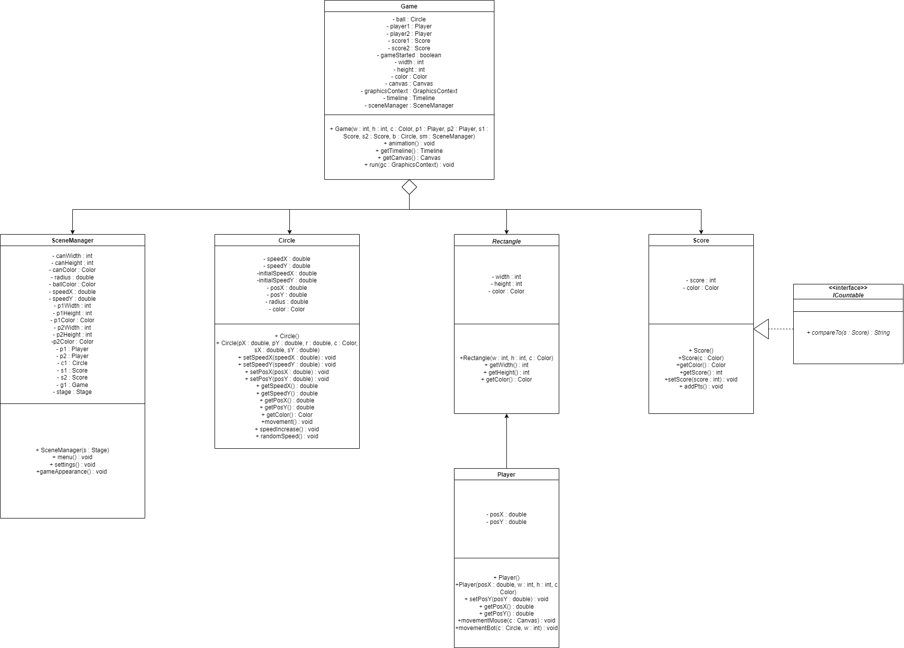

Project title: Ping and Pong

This game, made using Javafx, is called Ping and Pong. It is a two-player game in which 
the user(controlled by the position of the mouse) will fight against a simple bot. To gain a point, the player
has to make the ball touch the opponent’s side. In Ping and Pong, the balls’ 
speed, radius, and color as well as the width, height, and color of the 2 players can be determined by the user's inputs 
in the settings menu. Over time, the speed of the ball will increase which will make the game more challenging to beat.

To build the game, I had to resort to classes such as Canvas, GraphicsContext, Timeline to handle the
animations of the objects as well as drawing them unto the canvas. I also had to use a mouse click event to reset 
the position of the ball after a point or to go back to the menu page after a player reached 5 pts. I also used
buttons, textfields, labels.

One of the challenges I faced along the way was that I didn't really know how to make the animation classes work since
I had never learned it in class. I got stuck a lot early on since I hadn't included certain methods of these
classes to make the animation functional and to make the game appear. Another one of the challenges was that
I was struggling to link scenes together since I also had never practiced that before. I knew it was possible,
but that also took a lot of time to figure out as I was trying various methods to find the solution. In the end,
my teacher, Mr. Tawfiq, proposed to create a different class, SceneManager to handle the changes of scenes. One of the
features that I wish to include in the future is a difficulty setting(easy, medium, impossible) to indicate how well the
bot tracks the ball. I'd also like to include certain sound effects whenever the player wins, clicks a button or when
the ball hits something. There could also be a mode where the second player(Pong) is actually controlled by another 
user using the up and down arrow keys.

My Game class has 2 players, 2 scores, 1 circle(ball), a canvas, a graphics context, a timeline, a scene manager, etc. It
handles all the methods and behaviours of the elements in my game by putting them together. The run method
is constantly called because of the timeline which allows certain elements to be animated by modifying their positioning. 
The Player class inherits from the Rectangle class. It also handles the positioning of Ping(the player being controlled 
using mouse) as well as the positioning of Pong(the bot) according to the positioning of the ball. The Rectangle
class is abstract, so it cannot be instantiated. The Circle class creates the ball. It contains a method
that randomizes its direction, another that increases the speed according to the direction of the ball, one that 
moves its position X and Y. The ICountable interface contains 1 method. It compares the two scores and returns a winner. 
The Score class keeps count of the scores. It also contains a method to increment the score. It implements ICountable. 

UML Diagram
